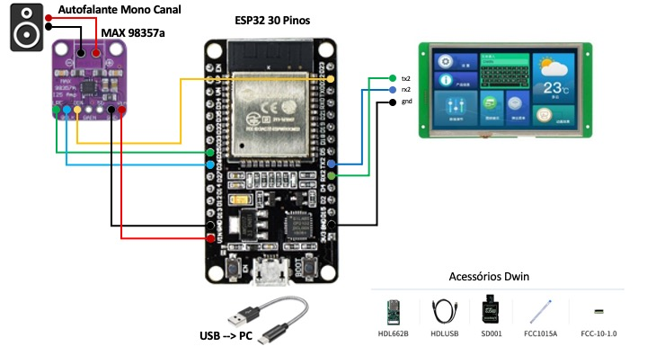

# DwinMusicPlayer

> Exemplo de um Music Player com Display Dwin e Esp32

## Display HMI

Existe uma  [diferença essencial entre um display HMI e um display touch screen](https://www.stoneitech.com/the-difference-between-hmi-and-touch-screen-display) .

Isso ocorre porque o Touch Screen é  **apenas a parte de hardware**  que pode ser usada em telas HMI. Um display  **HMI** é um equipamento de interação humano-computador  que inclui  **hardware e software**. De uma forma simples, isto permite embarcar as telas, configurações e até rotinas internas (código) dentro das telas. Esta seria sua principal diferença para uma tela LCD comum, que apenas exibe a imagem enviada por um dispositivo.

Existem diferentes marcas no mercado, sendo a Nextion, Proculus e Dwin uma das mais conhecidas. Aqui usamos o display Dwin de 7 polegagadas com toque capacitivo, modelo DMG80480C070_04WTC.

## MAX98357

Um link interessante para conhecer este amplificador é o site da  [Adafruit](https://learn.adafruit.com/adafruit-max98357-i2s-class-d-mono-amp/overview). A função do max98357 basicamente é receber um sinal digital de entrada pela interface I2S e converter para uma saída analógica amplificada de 3w. 

## Vídeos no Youtube

Através do canal do LSI - Laboratório de Suporte a Inovação, temos um canal no Youtuve com uma serie de vídeos detalhando o passa a passo dessa construção.

[Benevid Felix Silva - YouTube](https://www.youtube.com/channel/UCi7gBAP6aJ4a9hklch_a1zw/)

## Referências

- Bluetooth A2DP API - https://github.com/pschatzmann/ESP32-A2DP

- Biblioteca Original dWin LCD HMI Arduino - https://github.com/akkoyun/dWin
